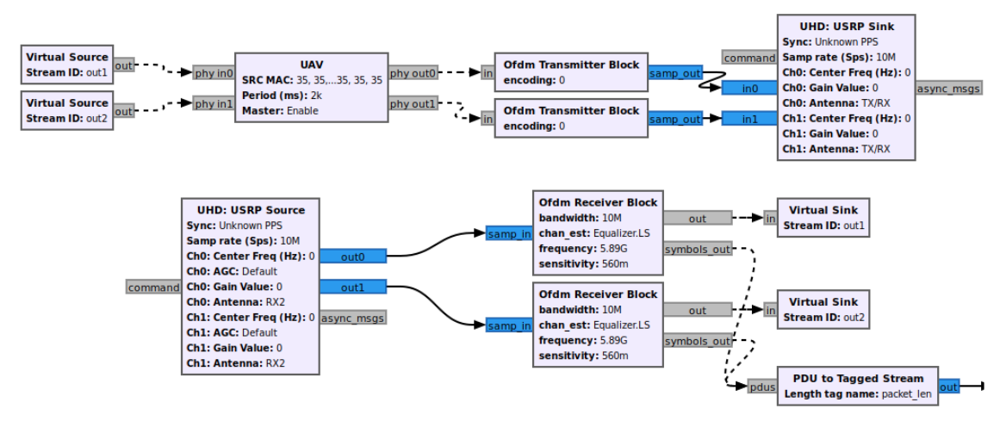

# final-project

## Abstract
SDR (Software Defined Radio) provides flexible, reproducible and longer-lasting radio tools for military and civilian wireless communications infrastructure. SDR is a radio (radio frequency) communication system whose components are implemented as software. In this study, it is aimed to establish multi-channel wireless communication with FANET between two SDRs, to send location information as data, to examine the effects of different modulation techniques and environmental factors on data transport. It is aimed to use multi-channel token distribution as link layer protocol, MIMO as communication access technology and GNU Radio platform for SDR software development. The structures of the communication layer such as the protocols, communication systems, network structures suggested in the studies in the literature are generally tested in the simulation environment. The simulation environment provides researchers with fast and easy development and testing, but there are also disadvantages. These cause a product to be isolated from hardware, software and cost effects that may be encountered while developing, and from environmental factors affecting the communication channel while testing. In this study, it is aimed to establish a realistic test environment, and another contribution of the study is to present the developed block diagrams and codes as clear and reproducible.

## GNU Radio Block Diagram


## Building
- Before, install GNU Radio (v3.10) and dependencies from [Installing GR](https://wiki.gnuradio.org/index.php/InstallingGR)
- Then clone the repo to a local directory
- Build the project by following the below steps
```
 $ mkdir build && cd build
 $ cmake ..
 $ make
 $ sudo make install
 $ sudo ldconfig
```
- After that, check ```/usr/local/include```, ```/usr/local/lib``` directories to see headers, and libs
- If you want to recompile code base you can just use ```sudo make uninstall``` then rebuild the project. If it doesn't work you can delete the libs by manually then rebuild.
- If you have still troubles there are some answered questions [troubleshooting](https://github.com/bastibl/gr-ieee802-11#troubleshooting-1)

### Adding new module
- Add a block to the module: gr_modtool add BLOCKNAME
- Create a build directory (under the ```gr-<module name>/grc```): 
- Bind the new added block ```gr_modtool bind BLOCKNAME```
- Invoke the make process: ```cd build && cmake <OPTIONS> ../ && make``` (Note that you only have to call cmake if you've changed the CMake files)
- Call ```gr_modtool makexml BLOCKNAME``` or ```gr_modtool makeyaml BLOCKNAME``` to generate the xml or yaml file for your blocks. Correct manually if needed.
- Install (only when everything works and no tests fail): sudo make install
- Ubuntu users: reload the libs: sudo ldconfig
- Rename a block in the module: ```gr_modtool rename BLOCKNAME```
- Delete blocks from the source tree: ```gr_modtool rm REGEX```
- Disable blocks by removing them from the CMake files: ```gr_modtool disable REGEX```

## Citation
Here are some key resources I used while developing the code for this project. I developed this project on top of [gr-ieee802-11](https://github.com/bastibl/gr-ieee802-11) as it has a lot of blocks that I need. I also tried to modernise the [Alamouti code](https://github.com/zaeemzadeh/MIMO-OFDM-Alamouti) that developed in gr3.7.
```
@inproceedings{bloessl2013ieee,
  title={An IEEE 802.11 a/g/p OFDM Receiver for GNU Radio},
  author={Bloessl, Bastian and Segata, Michele and Sommer, Christoph and Dressler, Falko},
  booktitle={Proceedings of the second workshop on Software radio implementation forum},
  pages={9--16},
  year={2013}
}
```
```
@github{github.com/zaeemzadeh/MIMO-OFDM-Alamouti,
  title={MIMO-OFDM with Alamouti space-time coding},
  author={Zaeemzadeh, Alireza},
  year={2014}
}
```
```
@github{github.com/kit-cel/gnuradio, github.com/MLsmd/GSoC18-proposal
  title={MIMO basics for GNU Radio},
  author={Schmid, Moritz Luca},
  year={2018}
}
```
